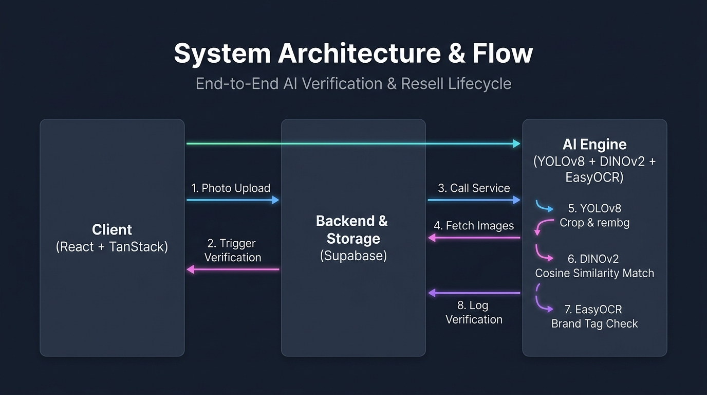

# ReSell by Myntra

[](https://github.com/sameeksha-87/myntra-resell)
[](https://github.com/sameeksha-87/myntra-resell)

An AI-powered, closed-loop circular fashion marketplace built directly into the Myntra ecosystem. ReSell allows users to instantly list their authenticated past purchases for resale, using computer vision to verify item authenticity and condition, and crediting earnings as Myntra Coins to keep capital flowing within Myntra.

---

## Live Demo

The web application is deployed and publicly accessible at:
👉 **[https://myntra-resell.glib-respect.workers.dev](https://myntra-resell.glib-respect.workers.dev)**

*Note: Since the serverless environment on Cloudflare cannot execute the Python-based machine learning pipeline locally, image verification on the live URL will default to verification pending/failed. For a live demonstration of the full AI authenticity verification (including YOLO object detection, background removal, and DINOv2 visual similarity matching), please refer to the Local Setup instructions below.*

---

## Value Proposition

* **For Customers:** One-click listings with zero manual data entry, guaranteed authenticity for buyers, and instant liquidity in Myntra Coins.
* **For Myntra:** 100% customer retention (Myntra Coins lock spending on-platform), a new 10% transactional commission stream, and leadership in sustainable, circular commerce.

---

## Key Features

### Closet Sync
Instantly imports a user's purchase history (items bought within the last 3 years over ₹3,000) into a "Resell Closet". Eliminates the friction of writing titles, uploading stock photos, or guessing sizes.

### AI Verification & Anti-Fraud
Multi-stage image verification pipeline ensuring that the listed item matches the original purchase:
1. **EXIF Transposition:** Automatically rotates uploads based on phone camera metadata to prevent layout mismatch.
2. **YOLO Garment Cropping & rembg Background Stripping:** Detects the clothing item using YOLO to crop around the garment, and uses rembg to isolate it and remove background clutter or skin.
3. **Visual Embedding Comparison (DINOv2 & OpenCLIP):** Computes cosine similarity between the catalog photo and the user's cropped smartphone photo using DINOv2 (and OpenCLIP fallback) to verify it is the correct product.
4. **Color & Brand OCR Verification:** Compares HSV color histograms and runs EasyOCR on the image to verify the brand matches and detect potential counterfeits.

### Smart AI Pricing
Dynamically estimates resale price based on the brand's tier (Standard/Premium), purchase age (annual depreciation curve), and declared item condition (Pristine, Excellent, Good).

### Verified Drafts & "Go Live"
Sellers control when their listings go live. AI verification saves the listing as a hidden "Verified Draft", keeping it off the public marketplace until the seller explicitly clicks the "Go Live" button.

### Myntra Coins Payout
When an order checkout is completed, the seller’s profile is instantly credited with Myntra Coins (virtual currency) and sent a notification, creating a closed-loop marketplace.

---

## Tech Stack

| **Layer** | **Technologies** | **Role / Responsibility** |
|-----------|------------------|---------------------------|
| **Frontend** | React 19, TypeScript, Tailwind CSS v4 | Responsive user interface, closet management, upload wizard, active listings dashboard |
| **Full-Stack Backend** | TanStack Start, Vite | Server-side rendering, API routes, server functions, checkout workflow, pricing rules engine |
| **Database & Storage** | Supabase (PostgreSQL), Supabase Storage Buckets | Store user data, listings, order records, listing states, and uploaded product images |
| **AI Inference Engine** | Python 3, PyTorch, YOLO (Ultralytics), rembg, DINOv2, EasyOCR, OpenCV | Garment detection & cropping, background removal, EXIF orientation correction, visual similarity search, OCR-based brand verification |

---

## System Architecture & Flow



The application handles verification using a 4-stage pipelined background daemon:
1. **YOLOv8** extracts the bounding box of the garment, cropping out background noise.
2. **rembg** isolates the product by removing background pixels (e.g. hangers, walls, flooring).
3. **DINOv2** computes high-dimensional embeddings of the stock and user photos, assessing visual similarity via cosine distance.
4. **EasyOCR** scans the collar tag for text validation to confirm the seller's brand claims.

---

## Project Structure

```text
myntra-resell/
├── src/                          # Web application source code
│   ├── components/               # React components
│   │   ├── ui/                   # Reusable shadcn/Radix UI widgets
│   │   ├── product-card.tsx      # Listing card component
│   │   ├── site-header.tsx       # Main header & navigation bar
│   │   └── trust-badges.tsx      # Badges showing authentication status
│   ├── hooks/                    # Custom React hooks
│   ├── integrations/             # Third-party integrations
│   │   └── supabase/             # Supabase DB client & operations
│   │       ├── actions.server.ts # Server Functions for listing, DB & AI triggers
│   │       ├── auth-attacher.ts  # Session propagation utilities
│   │       ├── auth-middleware.ts# Server authentication guards
│   │       ├── client.server.ts  # Node-specific Supabase client (service role)
│   │       ├── client.ts         # Isomorphic frontend Supabase client
│   │       └── types.ts          # Generated database schema types
│   ├── lib/                      # Helper libraries & utility functions
│   ├── routes/                   # File-based TanStack Start routes
│   │   ├── __root.tsx            # Root application layout
│   │   ├── index.tsx             # Homepage / public listings feed
│   │   ├── admin.tsx             # Admin validation dashboard
│   │   ├── auth.tsx              # Authentication login/signup view
│   │   ├── bag.tsx               # Shopping cart interface
│   │   ├── checkout.tsx          # Order placement & Myntra Coin transaction handling
│   │   ├── listing.$id.tsx       # Single public product details
│   │   ├── orders.tsx            # Order history details
│   │   ├── product.$id.tsx       # Purchased catalog items detail view
│   │   ├── profile.tsx           # User settings & Myntra Coins balance
│   │   ├── resell.$orderId.tsx   # AI verification, crop wizard, and listing price estimator
│   │   └── wishlist.tsx          # User's saved listings
│   ├── router.tsx                # TanStack Start router setup
│   ├── server.ts                 # Nitro server entrypoint for backend
│   ├── start.ts                  # Vite client entrypoint for frontend
│   └── styles.css                # Global CSS styling
├── supabase/                     # Local Supabase configuration & migrations
│   ├── migrations/               # PostgreSQL schema & trigger migrations
│   └── config.toml               # Supabase configuration file
├── verify_clip_service.py        # Main Python verification daemon server & CLI pipeline
├── verify.py                     # Initial standalone Python verification script
├── best.pt / yolov8n.pt          # Pre-loaded YOLO weights for garment crop
├── package.json                  # Javascript package metadata & scripts
├── bun.lock                      # Bun lockfile for Javascript dependencies
├── tsconfig.json                 # TypeScript compiler configuration
├── vite.config.ts                # Vite & Vinxi configuration file
└── README.md                     # Project documentation
```

---

## Developer Setup & Installation

### Prerequisites
* **Node.js** (v18+) or **Bun** (Recommended)
* **Python** (3.9+) with `pip`

### 1. Web Application Setup
1. Clone the repository and navigate to the directory:
   ```bash
   git clone git@github.com:sameeksha-87/myntra-resell.git
   cd myntra-resell
   ```
2. Install Javascript dependencies:
   ```bash
   bun install  # or npm install
   ```
3. Set up environment variables in a `.env` file in the root:
   ```env
   SUPABASE_URL=your_supabase_project_url
   SUPABASE_SERVICE_ROLE_KEY=your_service_role_key
   ```
4. Start the development server:
   ```bash
   bun run dev
   ```

### 2. AI Service Setup
1. Create and activate a Python virtual environment:
   ```bash
   python -m venv venv
   source venv/bin/activate  # On Windows use: venv\Scripts\activate
   ```
2. Install Python dependencies:
   ```bash
   pip install torch torchvision open-clip-torch transformers numpy pillow ultralytics rembg easyocr opencv-python
   ```
3. Run a test validation script locally:
   ```bash
   python verify_clip_service.py db_orig.jpg db_upl.jpg
   ```

---

## Future Roadmap

| Phase | Features |
|-------|----------|
| **Phase 1** | One-click listings, AI Smart Valuation, AI Verification, Secure Wallet Payments |
| **Phase 2** | Fabric & Stitching Verification, Enhanced Counterfeit Detection |
| **Phase 3** | AI Style Recommendations, Personalized Wallet Credit Offers |
| **Phase 4** | Cross-Brand Circular Marketplace, Category Expansion, Sustainability Dashboard |
