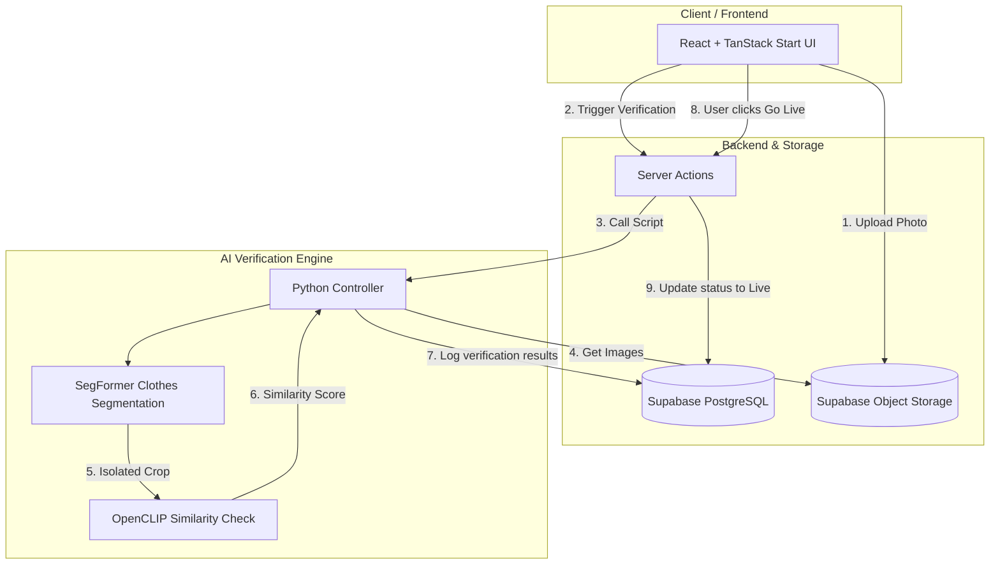

# ReSell by Myntra

[](https://github.com/sameeksha-87/myntra-resell)
[](https://github.com/sameeksha-87/myntra-resell)

An AI-powered, closed-loop circular fashion marketplace built directly into the Myntra ecosystem. ReSell allows users to instantly list their authenticated past purchases for resale, using computer vision to verify item authenticity and condition, and crediting earnings as Myntra Coins to keep capital flowing within Myntra.

---

## Value Proposition

* **For Customers:** One-click listings with zero manual data entry, guaranteed authenticity for buyers, and instant liquidity in Myntra Coins.
* **For Myntra:** 100% customer retention (Myntra Coins lock spending on-platform), a new 10% transactional commission stream, and leadership in sustainable, circular commerce.

---

## Key Features

### Closet Sync
Instantly imports a user's purchase history (items bought within the last 3 years over ₹3,000) into a "Resell Closet". Eliminates the friction of writing titles, uploading stock photos, or guessing sizes.

### AI Verification & Anti-Fraud
Multi-stage image verification pipeline ensuring that the listed item matches the original purchase:
1. **EXIF Transposition:** Automatically rotates uploads based on phone camera metadata to prevent layout mismatch.
2. **SegFormer Clothes Segmentation:** Isolates the garment, removes background clutter/human skin, and crops to the item boundaries.
3. **OpenCLIP Feature Comparison:** Computes cosine similarity between the catalog photo and the user's cropped smartphone photo to verify it is the correct product.

### Smart AI Pricing
Dynamically estimates resale price based on the brand's tier (Standard/Premium), purchase age (annual depreciation curve), and declared item condition (Pristine, Excellent, Good).

### Verified Drafts & "Go Live"
Sellers control when their listings go live. AI verification saves the listing as a hidden "Verified Draft", keeping it off the public marketplace until the seller explicitly clicks the "Go Live" button.

### Myntra Coins Payout
When an order checkout is completed, the seller’s profile is instantly credited with Myntra Coins (virtual currency) and sent a notification, creating a closed-loop marketplace.

---

## Tech Stack

| Layer | Technologies | Role / Responsibility |
| :--- | :--- | :--- |
| **Frontend** | React 19, TypeScript, TailwindCSS v4 | Closet interface, upload wizard, active listings tracking |
| **Fullstack Backend** | TanStack Start, Vite, Vinxi / Nitro | Server functions, checkout actions, pricing rules engine |
| **Database & Storage**| Supabase (PostgreSQL), Storage Buckets | Listings states, order items database, uploaded photos storage |
| **AI Inference Engine** | Python 3, PyTorch, OpenCLIP, SegFormer | Background stripping, EXIF correction, similarity checks |

---

## System Architecture & Flow



---

## Developer Setup & Installation

### Prerequisites
* **Node.js** (v18+) or **Bun** (Recommended)
* **Python** (3.9+) with `pip`

### 1. Web Application Setup
1. Clone the repository and navigate to the directory:
   ```bash
   git clone git@github.com:sameeksha-87/myntra-resell.git
   cd myntra-resell
   ```
2. Install Javascript dependencies:
   ```bash
   bun install  # or npm install
   ```
3. Set up environment variables in a `.env` file in the root:
   ```env
   SUPABASE_URL=your_supabase_project_url
   SUPABASE_SERVICE_ROLE_KEY=your_service_role_key
   ```
4. Start the development server:
   ```bash
   bun run dev
   ```

### 2. AI Service Setup
1. Create and activate a Python virtual environment:
   ```bash
   python -m venv venv
   source venv/bin/activate  # On Windows use: venv\Scripts\activate
   ```
2. Install Python dependencies:
   ```bash
   pip install torch torchvision open-clip-torch transformers numpy pillow
   ```
3. Run a test validation script locally:
   ```bash
   python verify_clip_service.py db_orig.jpg db_upl.jpg
   ```

---

## Future Roadmap

* **AI Wear-and-Tear Detection:** Automatically grading the condition (Pristine/Good/Fair) by analyzing fabric pills, tears, and discoloration.
* **Logistics pickup integration:** Quality checks executed by delivery partners at the doorstep via a simplified companion app synced to our AI checks.
* **AI Visual Search:** Enabling buyers to upload a photo to find visually similar pre-loved clothes listed on the marketplace.
